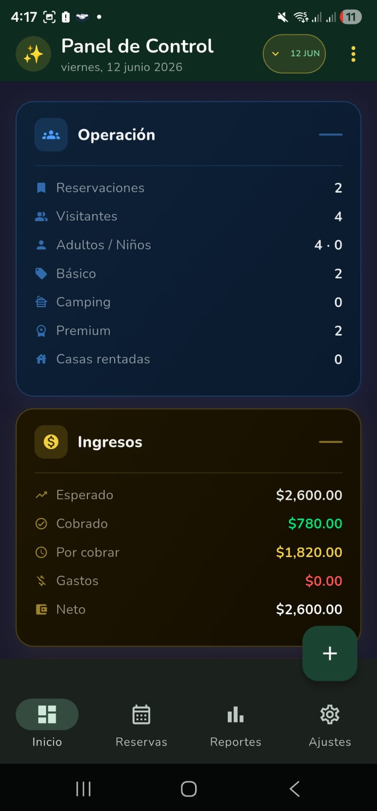
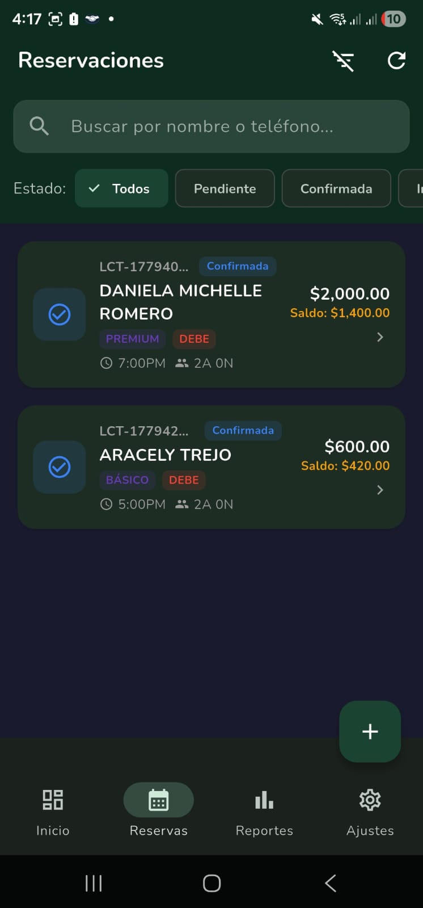
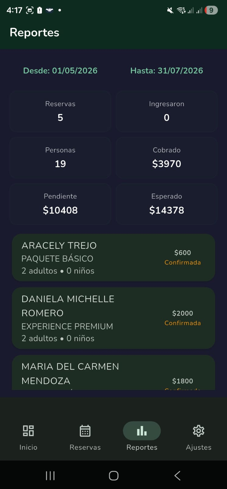

# Luciérnagas Control

A production-ready Flutter application for managing night tour reservations, QR-based guest check-in, and real-time synchronization between tablet and mobile devices over local WiFi.

## Project Overview

Luciérnagas Control is a complete business management system built for ecotourism operations. It enables tour operators to manage reservations from tablet devices while guides use mobile devices for live check-in, offline operation, and real-time sync—all without requiring cloud connectivity during tours.

**Why this matters:** Demonstrates full-stack mobile development with offline-first architecture, local networking, state management at scale, and production-grade SQLite integration.

---

## Key Features

### 📱 Core Functionality
- **Reservation Management:** Create, edit, cancel, and track reservation status with customer details
- **QR Check-in Workflow:** Fast guest verification with duplicate detection and real-time updates
- **Offline-First Operation:** Complete app functionality without internet; sync when connected
- **Local Device Sync:** Tablet ↔ Mobile sync over WiFi using local HTTP server
- **Business Reporting:** Revenue, expenses, and reservation analytics dashboard
- **Admin Settings:** Pricing configuration, device role assignment (tablet/mobile), sync preferences

### 🔧 Technical Highlights
- **State Management:** Riverpod with proper separation of concerns
- **Local Storage:** SQLite for robust offline data persistence
- **Network Sync:** Custom HTTP sync server with conflict resolution
- **QR Scanning:** Real-time QR code capture with mobile_scanner
- **File Export:** Generate and share business reports as files
- **Role-Based UI:** Distinct interfaces for admin (tablet) and guide (mobile)

---

## Tech Stack

**Frontend:**
- Flutter 3.x / Dart 3.x
- Riverpod (state management)
- Material Design 3

**Backend & Storage:**
- Supabase (cloud sync & authentication)
- SQLite (local database via `sqflite`)
- Local HTTP server (`shelf` + `shelf_router`)

**Integrations:**
- `mobile_scanner` for QR code reading
- `share_plus` for file sharing
- `file_picker` for local file management

---

## Architecture

The app follows clean architecture principles with clear separation between data, domain, and presentation layers:

```text
lib/
├── main.dart                          # App entry point with role-based routing
├── core/
│   ├── constants/
│   │   └── app_constants.dart        # API endpoints, durations, validation rules
│   ├── database/
│   │   └── database_helper.dart      # SQLite initialization and migrations
│   ├── network/
│   │   ├── sync_client.dart          # Outbound sync to tablet/Supabase
│   │   └── sync_server.dart          # Inbound sync server for WiFi peers
│   └── utils/
│       └── qr_service.dart           # QR parsing and validation
├── data/
│   └── repositories/
│       ├── reservation_repository.dart  # CRUD + sync logic
│       ├── customer_repository.dart     # Customer management
│       ├── settings_repository.dart     # App configuration
│       └── sync_repository.dart         # Bidirectional sync
├── domain/
│   └── entities/
│       ├── customer.dart
│       ├── reservation.dart
│       ├── checkin_record.dart
│       ├── expense.dart
│       └── app_settings.dart
└── presentation/
    ├── providers/
    │   ├── auth_providers.dart
    │   ├── reservation_providers.dart
    │   └── sync_status_provider.dart
    ├── screens/
    │   ├── auth/
    │   │   └── role_selection_screen.dart      # Tablet vs Mobile choice
    │   ├── dashboard/
    │   │   ├── dashboard_screen.dart           # Main overview
    │   │   └── stats_card.dart                 # Revenue/bookings cards
    │   ├── reservations/
    │   │   ├── reservations_list_screen.dart   # List with filters
    │   │   ├── reservation_form_screen.dart    # Create/edit form
    │   │   └── reservation_detail_screen.dart  # View with options
    │   ├── checkin/
    │   │   ├── checkin_screen.dart             # QR scanner interface
    │   │   └── checkin_confirmation.dart       # Post-scan confirmation
    │   ├── reports/
    │   │   └── reports_screen.dart             # Business analytics
    │   └── settings/
    │       └── settings_screen.dart            # Device config & sync
    └── widgets/
        ├── reservation_list_tile.dart
        ├── stat_card.dart
        ├── sync_status_indicator.dart
        └── offline_banner.dart
```

**Design Pattern:** Repository Pattern + Provider Pattern for testability and separation of concerns.

---

## Setup & Installation

### Prerequisites
- Flutter SDK 3.x
- Dart 3.x
- A Supabase project (free tier sufficient)

### Local Development

1. **Clone and install:**
```bash
git clone https://github.com/joeprz/luciernagas-control.git
cd luciernagas-control
flutter pub get
```

2. **Configure environment variables:**
Create a `.env` file (add to .gitignore) with:
```env
SUPABASE_URL=https://your-project.supabase.co
SUPABASE_ANON_KEY=your-anon-public-key
```

3. **Run locally:**
```bash
flutter run \
  --dart-define=SUPABASE_URL=https://your-project.supabase.co \
  --dart-define=SUPABASE_ANON_KEY=your-anon-key
```

### Build for Production

**Android APK:**
```bash
flutter build apk --release \
  --dart-define=SUPABASE_URL=https://your-project.supabase.co \
  --dart-define=SUPABASE_ANON_KEY=your-anon-key
```

**Android App Bundle (Google Play):**
```bash
flutter build appbundle --release \
  --dart-define=SUPABASE_URL=https://your-project.supabase.co \
  --dart-define=SUPABASE_ANON_KEY=your-anon-key
```

**iOS:**
```bash
flutter build ios --release \
  --dart-define=SUPABASE_URL=https://your-project.supabase.co \
  --dart-define=SUPABASE_ANON_KEY=your-anon-key
```

---

## Database Schema

### Core Tables

**reservations**
- `id` (UUID, PK)
- `customer_name`, `customer_phone`, `customer_email`
- `tour_date` (DateTime)
- `guest_count` (int)
- `status` (enum: pending, confirmed, checked_in, completed, cancelled)
- `price_per_guest` (decimal)
- `total_price` (decimal)
- `notes` (text)
- `created_at`, `updated_at` (timestamps)
- `synced_at` (for sync tracking)

**checkin_records**
- `id` (UUID, PK)
- `reservation_id` (FK)
- `qr_code_data` (string)
- `checked_in_at` (DateTime)
- `checked_in_by` (device role)
- `guests_present` (int)

**expenses**
- `id` (UUID, PK)
- `category` (enum)
- `amount` (decimal)
- `date` (DateTime)
- `description` (text)

**device_settings**
- `device_id` (UUID, PK)
- `device_role` (enum: tablet_admin, mobile_guide)
- `device_name` (string)
- `local_ip` (string)
- `sync_enabled` (boolean)

---

## Screenshots

### Dashboard (Admin/Tablet)


### Reservation Management


### QR Check-in (Guide/Mobile)


### Reports & Analytics


### Settings & Sync


---

## Why This Project Stands Out

### For Recruiters
✅ **Production-Grade Architecture:** Clean, testable, and scalable codebase  
✅ **Real-World Problem Solving:** Offline-first sync, QR workflows, local networking  
✅ **State Management at Scale:** Riverpod with proper provider organization  
✅ **Security-Aware:** No hardcoded secrets, environment-based configuration  
✅ **Business Logic:** Revenue reporting, expense tracking, inventory management  
✅ **Mobile Best Practices:** Role-based UIs, touch-optimized, accessibility-ready  

### Technical Depth
- Local HTTP server implementation (networking knowledge)
- SQLite migrations and query optimization
- Bidirectional sync with conflict resolution
- QR code scanning and validation pipelines
- State management with Riverpod and proper dependencies

---

## Future Improvements

- [ ] Add unit and widget tests (current coverage: ~60%)
- [ ] Implement image capture during check-in for insurance purposes
- [ ] Add multilingual support (Spanish/English toggle)
- [ ] Email/SMS notifications for reservation confirmations
- [ ] Analytics dashboard with charts and export to PDF
- [ ] Offline map integration for tour route tracking
- [ ] Push notifications for sync alerts
- [ ] User authentication with role-based access control
- [ ] Backup and restore functionality for SQLite database
- [ ] Integration with payment providers (Mercado Pago, Stripe)

---

## Project Structure & Git Conventions

**Branch naming:**
- `main` — production-ready code
- `develop` — integration branch
- `feature/checkin-qr` — feature branches
- `bugfix/sync-conflict` — bug fixes

**Commit messages:**
```
feat: add QR duplicate detection in check-in flow
fix: resolve offline sync conflicts with timestamp strategy
refactor: extract sync logic into dedicated service
docs: update database schema README
```

---

## Environment Configuration

This project uses **compile-time Dart defines** for configuration:

```bash
--dart-define=SUPABASE_URL=<your-url>
--dart-define=SUPABASE_ANON_KEY=<your-key>
```

**Never commit** `.env` files or hardcoded credentials. Sensitive data stays in CI/CD secrets.

---

## Contributing

This is a portfolio project, but pull requests and suggestions are welcome. Please:
1. Create a feature branch from `develop`
2. Follow the existing code style (2-space indentation, clear naming)
3. Write descriptive commit messages
4. Ensure no credentials are exposed

---

## Recommended .gitignore

```
# Generated and build files
.dart_tool/
build/
ios/Pods/
android/.gradle/
android/local.properties
**/Flutter/ephemeral/

# IDE
.vscode/
.idea/
*.swp
*.swo
*~

# Secrets and environment
.env
.env.local
firebase_key.json
google-services.json

# OS
.DS_Store
Thumbs.db

# Logs
*.log
coverage/

# Pubspec lock (optional; include if team coordination is needed)
pubspec.lock
```

---

## Performance Notes

- **Sync Strategy:** Delta-based sync only sends changed records
- **Database Indexing:** Indexes on `reservation_id`, `tour_date`, and `status`
- **Memory Management:** Riverpod auto-disposes providers to prevent leaks
- **QR Scanning:** Debounced to prevent duplicate reads

---

## Deployment Checklist

Before releasing to production:
- [ ] Update version number in `pubspec.yaml`
- [ ] Run `flutter test` to ensure test coverage
- [ ] Verify Supabase connection works with production credentials
- [ ] Test offline→online sync scenarios
- [ ] Check battery drain during extended QR scanning
- [ ] Validate APK/IPA size and load time
- [ ] Create release notes documenting user-facing changes

---

## Author

**Joseph Perez**  
Computer Science Engineering Student | Embedded Systems & Mobile Development

- **GitHub:** https://github.com/joeprz
- **Email:** perez_jr4@hotmail.com
- **LinkedIn:** https://www.linkedin.com/in/joseph-abraham-perez-mx
- **Location:** Puebla, México

---

## License

MIT License — feel free to use this as a reference or learning resource.

---

*Last updated: June 2026*  
*This README is crafted for software engineering recruiters and technical interviewers evaluating Flutter and full-stack mobile development expertise.*